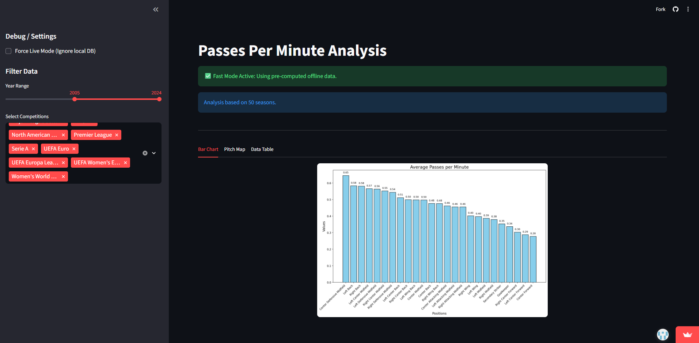
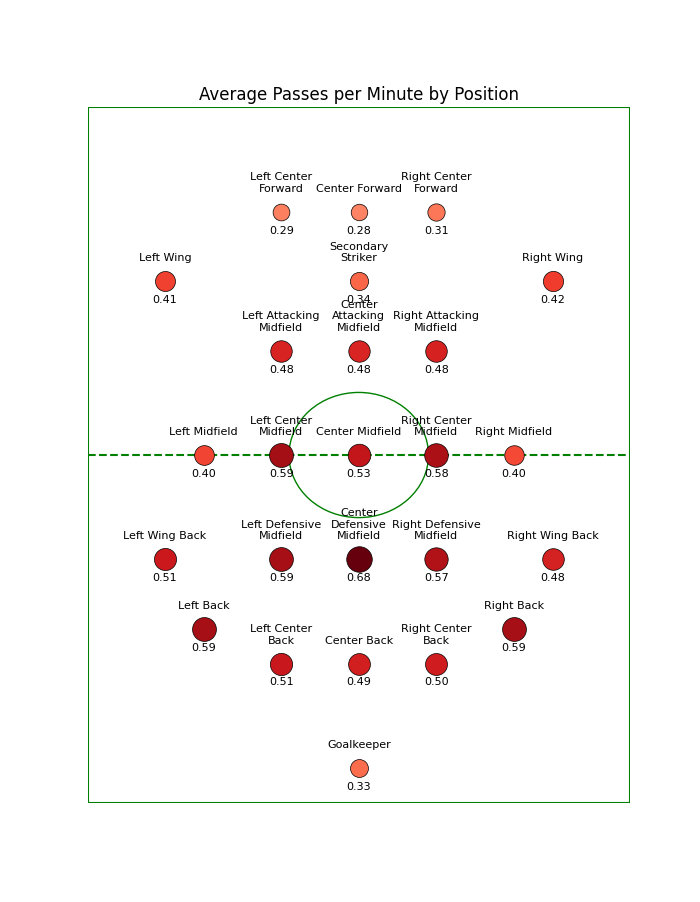
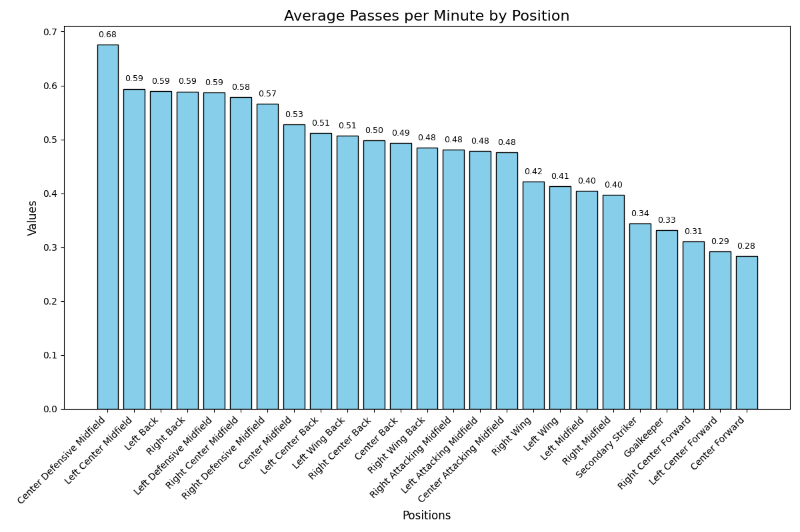

# ⚽ PassesPerMinute — Average Passes per Minute by Position in Football

**PassesPerMinute** is a Python-based analytical project that evaluates the **average number of passes per minute** by player position using **StatsBomb Open Data**, accessible via a processing pipeline or an **interactive Streamlit dashboard**.  
It covers matches from **professional competitions** (2009–2024), highlighting tactical trends and positional behaviors across modern football.

> **License:** `CC0-1.0` *(see [LICENSE](LICENSE) for details)*

---

## ⚙️ Technologies

### Runtime
- **Python** 3.12-3.14
- **Streamlit** — interactive web dashboard for data visualization
- **requests** — fetching event data from StatsBomb Open Data  
- **matplotlib** — creating visualizations (bar charts, football pitch map)  
- **concurrent.futures** — parallel match data processing  
- **logging** — unified structured logs for analysis runs  

### Production / Development
- **Poetry** — dependency and package management
- **requirements.txt / requirements-dev.txt** — pip installation 
- **MkDocs** — documentation site (`docs/`, `mkdocs.yml`)  
- **pre-commit** — code quality enforcement (Black, Ruff, mypy)  
- **CI/CD** – GitHub Actions (`.github/workflows/ci.yml`)
- **Black** – code formatting  
- **Ruff** – linting and style enforcement  
- **mypy** – static type checking   

---

## 🧠 Overview

The project analyzes the **average number of passes per minute** for each position on the football pitch using event-based data from the **StatsBomb Open Data repository**.  
By analyzing matches from **professional competitions** across various leagues and tournaments (2009–2024), it identifies **patterns and trends** in passing behavior by position.

The analysis is based on **event-level data** (passes, substitutions, lineups) and visualized using **static plots and a dynamic web interface (Streamlit)** to improve interpretation and allow for real-time data exploration.

---

## 📊 Dataset Overview

Matches analyzed: **2617 games**  
Time frame: **2009–2024**  
Source: [StatsBomb Open Data Repository](https://github.com/statsbomb/open-data)

The dataset includes only **elite-level competitions**, ensuring a consistent level of tactical and technical quality.

### Competitions and Seasons

- **1. Bundesliga**: 2023/2024, 2015/2016  
- **African Cup of Nations**: 2023  
- **Champions League**: 2009/2010–2018/2019  
- **Copa America**: 2024  
- **FIFA World Cup**: 2018, 2022  
- **La Liga**: 2009/2010–2020/2021  
- **Ligue 1**: 2015/2016, 2021/2022, 2022/2023  
- **Premier League**: 2015/2016  
- **Serie A**: 2015/2016  
- **UEFA Euro**: 2020, 2024  

---

## 🧩 Analysis Process

1. **Data Collection**  
   Matches are selected by competition & season filters. Event data (passes, substitutions, lineups) are fetched for each match.

2. **Player Position Tracking**  
   Player positions are tracked using starting formations and substitution events.

3. **Pass and Time Aggregation**  
   For each position, total passes and minutes played are calculated using timestamps.

4. **Average Pass Calculation**  
   Formula:  
   **Average Passes Per Minute = Total Passes / Minutes Played**

5. **Visualization**  
   Results are shown both as a **bar chart** and **football pitch heatmap**.

---

## 🖥️ Streamlit Web Dashboard

The project includes an interactive **Streamlit dashboard** that allows users to explore data dynamically without writing code.

👉 **[Launch Live App](https://passesperminute.streamlit.app/)**

### Features
- **Fast Mode (Offline):** Instantly visualizes pre-computed data from the local `granular_stats.json` database.
- **Live Mode (Online):** Connects to the StatsBomb API to fetch and process specific competitions/seasons on demand.
- **Interactive Visualizations:** Toggle between Bar Charts, Pitch Maps, and detailed Data Tables.
- **Custom Filters:** Filter statistics by specific year ranges and competition IDs.

---

## 🗂️ Project Structure

```
PassesPerMinute/
├─ .github/
│  └─ workflows/
│     └─ ci.yml  # GitHub Actions pipeline
│
├─ docs/
│  ├─ css/
│  │  ├─ mkdocstrings.css  # Styles for mkdocstrings API pages
│  │  └─ theme-variants.css  # Theme variants / overrides
│  ├─ gen_ref_pages/
│  │  ├─ config.py  # mkdocstrings config helpers
│  │  ├─ context.py  # Context building for generators
│  │  ├─ gen_ref_pages.py  # Entry script to generate ref pages
│  │  ├─ generate.py  # Generator orchestration
│  │  ├─ helpers.py  # Utility functions for ref generation
│  │  └─ traverse.py  # Module traversal utilities
│  └─ index.md  # Docs homepage
│
├─ readme_images/
│  ├─ bar_chart.png  # Bar chart visualization
│  └─ football_pitch_map.png  # Football pitch map visualization
│
├─ src/
│  └─ passes_per_minute/
│     ├─ __main__.py  # Module entry point (python -m passes_per_minute)
│     ├─ app.py  # Core execution script / CLI
│     ├─ streamlit_app.py  # Streamlit Web Application
│     ├─ logging_config.py  # Logging setup
│     ├─ passes_counter/
│     │  ├─ competition_manager.py  # Select competitions/seasons & enumerate matches
│     │  ├─ competition_processor.py  # Process an entire competition in parallel
│     │  ├─ http_client.py  # HTTP client for StatsBomb Open Data
│     │  ├─ match_processor.py  # Per-match event parsing & aggregation
│     │  └─ player_position_stats.py  # Track minutes by position and count passes
│     └─ plotter/
│        ├─ bar_chart.py  # Bar chart of passes per minute by position
│        └─ football_pitch_chart.py  # Football pitch heatmap of passes per minute
│
├─ tests/
│  ├─ passes_counter/
│  │  ├─ test_competition_manager.py  # Tests for competition selection
│  │  ├─ test_competition_process.py  # Tests for competition processing
│  │  ├─ test_http_client.py  # Tests for HTTP client
│  │  ├─ test_match_processor.py  # Tests for match processing
│  │  └─ test_player_position_stats.py  # Tests for position stats aggregation
│  └─ plotter/
│     ├─ test_bar_chart.py  # Tests for bar chart rendering
│     └─ test_football_pitch_chart.py  # Tests for football pitch chart
│
├─ .gitignore  # Git ignore rules
├─ .pre-commit-config.yaml  # Pre-commit hooks (Black, Ruff, mypy, etc.)
├─ LICENSE  # CC0-1.0 public domain license
├─ mkdocs.yml  # MkDocs configuration
├─ poetry.lock  # Poetry lockfile (exact dependency versions)
├─ pyproject.toml  # Project metadata & Poetry config
├─ pytest.ini  # pytest configuration
├─ README.md  # Project overview
├─ requirements.txt  # Runtime dependencies
├─ requirements-dev.txt  # Development dependencies
└─ run_dashboard.py  # Streamlit app launcher
```

---

## 🔧 Installation

### Option A — pip

**Users (runtime only):**
```bash
python -m venv .venv
source .venv/bin/activate      # macOS/Linux
.venv\Scripts\activate         # Windows

pip install --upgrade pip
pip install -r requirements.txt
pip install -e .
```

**Developers (runtime + dev):**
```bash
pip install -r requirements.txt -r requirements-dev.txt
pip install -e .
```

---

### Option B — Poetry

**Users (without dev):**
```bash
poetry install --without dev
poetry run passesperminute
```

**Developers (with dev):**
```bash
poetry install
poetry run passes_per_minute
```

---

## ▶️ Running the App

### From source
```bash
python -m passes_per_minute
```

### With Poetry
```bash
poetry run passesperminute
```

### After installation
```bash
passesperminute
```

### With Streamlit (local web dashboard)
```bash
poetry run streamlit run src/passes_per_minute/streamlit_app.py
```

---

## 📚 Documentation

Documentation is built with **MkDocs**.

```bash
mkdocs serve      # local preview (http://127.0.0.1:8000)
mkdocs build      # build into site/
```

---

## 🧰 Developer Tools

### Type checking
```bash
mypy src/
```

### Linting
```bash
ruff check .
```

### Auto-formatting
```bash
black --check .
```

### Run all pre-commit hooks locally
```bash
pre-commit run --all-files
```

---

## 📊 Results

| Position                    | Passes/Min |
|-----------------------------|------------|
| Center Defensive Midfield   | 0.67622    |
| Left Center Midfield        | 0.59383    |
| Left Back                   | 0.58943    |
| Right Back                  | 0.58879    |
| Left Defensive Midfield     | 0.58681    |
| Right Center Midfield       | 0.57829    |
| Right Defensive Midfield    | 0.56643    |
| Center Midfield             | 0.52749    |
| Left Center Back            | 0.51183    |
| Left Wing Back              | 0.50638    |
| Right Center Back           | 0.49786    |
| Center Back                 | 0.49286    |
| Right Wing Back             | 0.48488    |
| Right Attacking Midfield    | 0.48143    |
| Left Attacking Midfield     | 0.47896    |
| Center Attacking Midfield   | 0.47598    |
| Right Wing                  | 0.42216    |
| Left Wing                   | 0.41283    |
| Left Midfield               | 0.40420    |
| Right Midfield              | 0.39661    |
| Secondary Striker           | 0.34428    |
| Goalkeeper                  | 0.33203    |
| Right Center Forward        | 0.31038    |
| Left Center Forward         | 0.29252    |
| Center Forward              | 0.28389    |

---

### 📈 Visualizations

#### Streamlit Dashboard


#### Football Pitch Map


#### Bar Chart


---

### Known Limitations

- Missing events = partial gaps in positional time tracking.  
- Substitution times are approximate.  
- Event-centric approach may miss contextual gameplay data.  

---

## 📜 License

Released under **CC0-1.0 (public domain)**. You may copy, modify, distribute, and use it commercially without asking for permission.  